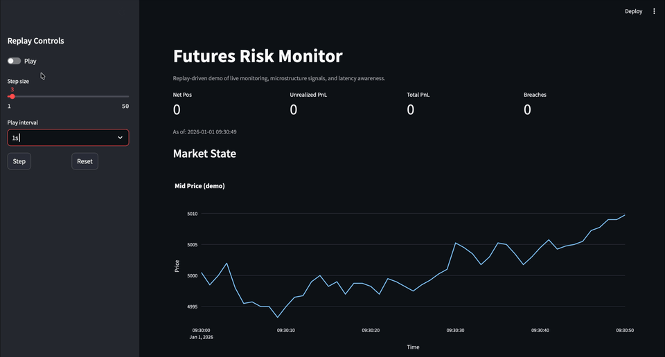
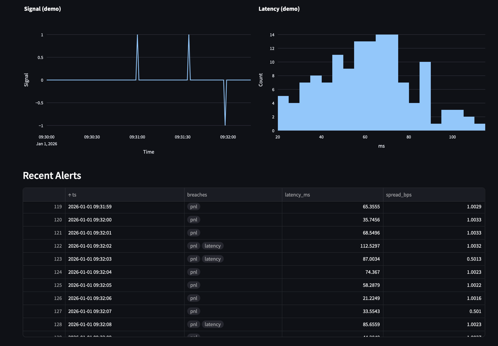
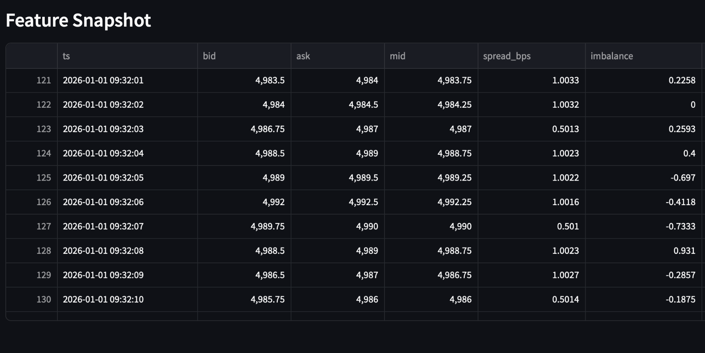

# Futures Risk Monitor

A replay driven dashboard for monitoring futures exposure, PnL, alerts, and latency in a workflow similar to that of a trading desk; designed to simulate a trading support environment.



## Highlights

- Real time monitoring currently using replayed market data; modular architecture enables processing of live market feeds as well.
- Position, exposure, and PnL tracking.
- Risk checks and alerting for: latency, spreads, pnl, net positions, gross notional.
- Latency aware event handling.
- A separate research notebook for microstructure exploration and signal testing.


## Screenshots
### Dashboard Charts






## Overview

A dashboard framework for tracking market, risk, and position metrics. The main app focuses on visibility, control, and clear decision support, whilst the notebook provides a smaller research sandbox for testing ideas and exploring feature behavior.

## Project Structure

- app.py: streamlit dashboard used for monitoring
- notebooks/: jupyter notebook for exploratory analysis and signal testing
- src/: synthetic data generation (replay.py), features analysis (microstructure.py), risk monitoring (config.py, risk.py), signal processing (pipeline.py)

## How It Works

1. Market and position data are replayed through a synthetic futures feed.
2. The system computes exposure, realized and unrealized PnL, and basic risk metrics at each step.
3. Rule-based threshold checks flag unusual conditions and limit breaches.
4. The dashboard highlights the most important information, trade markers, and alerts for quick review.
5. The notebook supports separate microstructure research and signal testing.

 ## Setup

```bash
git clone https://github.com/Chicago-tr/riskflow-dashboard.git
cd riskflow-dashboard
pip install -r requirements.txt
```

## Run the Project
To view in browser:
```bash
streamlit run app.py
```

## Future Work

- Add richer alerting and notification options.
- Improve the UI with more granular views.
- Expand the research notebook with more feature engineering.
- Add testing, logging, and configuration management.
- Demo with live market data.

